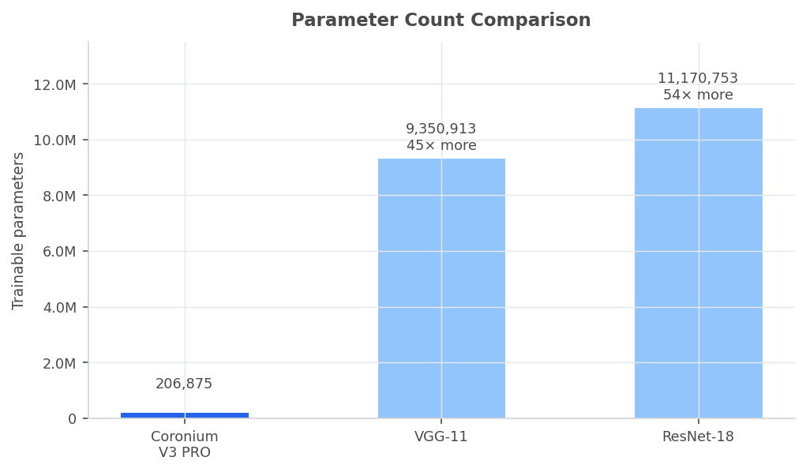
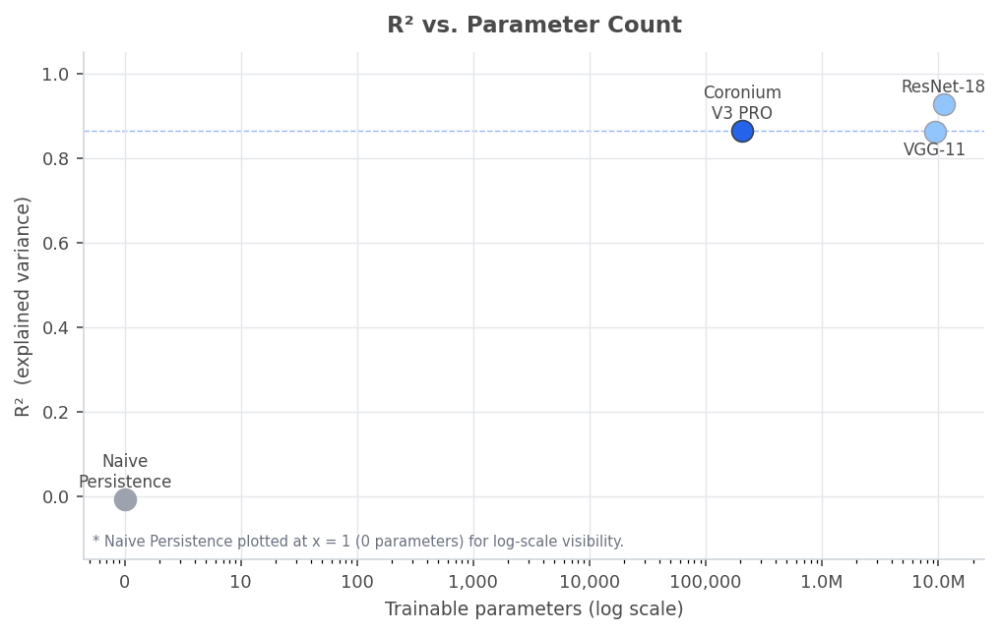

# Auralis

[](https://doi.org/10.5281/zenodo.20620546)

Auralis is a local research/demo system for estimating the current solar activity
index from NASA SDO/HMI magnetograms. It combines an offline data pipeline, a
small convolutional regression model, a FastAPI inference service, and a React
dashboard for inspection, explainability, and experiment review.

This project does not provide operational space-weather forecasts. The promoted
model estimates the activity index for the selected magnetogram in the processed
dataset.

## Objectives

- Train and evaluate a compact magnetogram regression model suitable for CPU
  inference.
- Preserve magnetic polarity information by representing each observation as
  separate B+ and B- channels.
- Serve reproducible local inference, Grad-CAM visualizations, benchmark data,
  and experiment metadata through a single API.
- Provide a dashboard that makes the model behavior inspectable without
  requiring notebook work.

## Current Model

Coronium V3.1 uses the unchanged four-stage `CoroniumV3` residual CNN with
Efficient Channel Attention (206,875 parameters) and the clean Phase 1.5 weights.
Input is float32 `(2, 512, 512)`: `[max(x,0), max(-x,0)]`, where
`x = clip(resize(B_LOS), -400, 400) / 400`. Output is raw SI pixel percentage.

| Item | Value |
| --- | --- |
| Promoted checkpoint | `auralis-back/models/best_coronium_v3_1.pth` |
| ONNX runtime model | `auralis-back/models/best_coronium_v3_1.onnx` |
| ONNX model size | 835,234 bytes, self-contained; dynamic batch, opset 18 |
| Release manifest | `auralis-back/models/coronium_v3_1_manifest.json` |
| Versioned metrics | `auralis-back/models/coronium_v3_1_metrics.json` |
| Source run | Phase 1.5 `20260905T132456995672Z`, best epoch 40 |

### V3.1 Evaluation Metrics

| Metric | Official MC Dropout T=20 | Deterministic ONNX/API protocol |
| --- | ---: | ---: |
| MAE (SI percentage points) | 0.10155762 | 0.20408340 |
| RMSE (SI percentage points) | 0.12337954 | 0.25823317 |
| R² | 0.87529664 | 0.45371922 |
| MAPE | 5.98702505% | 10.49751499% |

Both use the same 263 unique validation observations, with zero train/validation
observation overlap. Validation was used for checkpoint selection and early
stopping: this is not an untouched test or temporal generalization result.
Official MC metrics come unchanged from Phase 1.5 (seed 42, batch 32, MPS).
Serving metrics use one unperturbed eval-mode pass, before API rounding to four
decimals. Their lower performance is recorded explicitly; ONNX matches PyTorch
eval mode within `atol=rtol=1e-5` on all 263 observations.
`/api/stats` identifies both protocols separately; the scatter uses V3.1 MC data.

### Historical V3 Benchmark Comparison

This section and its figures preserve historical V3 results, including contaminated validation; they are not V3.1 performance or a clean ranking. Coronium's primary contribution is parameter efficiency. Benchmark comparisons
are scale-asymmetric: external baselines and Coronium are not always evaluated
under identical target-space assumptions, so raw MAE ranking should be
interpreted carefully. The main value of Coronium lies in its dual-polarity
representation, parameter efficiency, and lightweight deployment readiness.

| Model | Parameters | MAE† | R² |
| --- | ---: | ---: | ---: |
| Naive Persistence | 0 | 0.2882 | −0.008 |
| ResNet-18 | 11,170,753 | 0.0755 | 0.9276 |
| VGG-11 | 9,350,913 | 0.1079 | 0.8621 |
| **Coronium V3 PRO** | **206,875** | **0.1048** | **0.8634** |

†Baseline MAEs are reported in their native training scale; Coronium's MAE is
in raw SI percentage points (historical log-SI labels were incorrect). The protocols are not directly equivalent — treat the MAE column
as contextual, not a strict ranking. The primary differentiator for Coronium is
parameter efficiency, dual-polarity representation, reproducibility, and
historical deployment (86.6 KB graph excludes external weights; 25.11 ms is an old timing result, not V3.1 latency).

External baselines (ResNet-18, VGG-11) were retrained from scratch on the same
1,763-sample corpus using a single-channel collapsed input (`|B| = B+ + B−`).
Coronium V3 PRO uses the full dual-channel `(B+, B−)` representation.

### Historical V3 Efficiency Profile

Coronium V3 PRO achieves competitive explained variance (R² = 0.8634) with a
lightweight deployment footprint — 45–54× fewer parameters than VGG-11 and
ResNet-18 — and supports CPU-only ONNX inference at 25.11 ms per image.





| Model | Parameters | R² | Deployment note |
| --- | ---: | ---: | --- |
| Naive Persistence | 0 | −0.008 | Trivial baseline |
| VGG-11 | 9,350,913 | 0.8621 | Large CNN baseline |
| ResNet-18 | 11,170,753 | 0.9276 | Large CNN baseline |
| **Coronium V3 PRO** | **206,875** | **0.8634** | **Historical graph only, external weights required; old timing 25.11 ms** |

These preserved figures are historical illustrations. R² does not make different validation splits comparable; neither chart establishes a controlled ranking or V3.1 generalization.

### Dashboard API Uncertainty vs. Official Evaluation

The `/api/predict` endpoint reports an `uncertainty` field derived from
20 inference passes with small additive Gaussian input noise (σ = 0.005) via
ONNX Runtime. The primary prediction is a separate unperturbed deterministic pass.
The noise spread is a synthetic sensitivity heuristic without instrument calibration,
not the MC Dropout protocol. The canonical metrics above were produced by the
offline MC Dropout evaluation in `evaluate_final.py`.

## Dataset

Processed magnetograms live in `auralis-back/data/processed/` as `.npy` files.
The local CSV contains 1,763 rows representing 1,314 unique files, covering
2016-02-03 through 2026-04-12.

Preprocessing converts each magnetogram into a float32 tensor:

1. Load HMI FITS data.
2. Replace invalid limb-mask values with zero.
3. Resize to 512², clip to ±400 G and divide by 400; no input logarithm.
4. Split magnetic polarity into B+ and B- channels.
5. Save the result as `(2, 512, 512)`.

The backend still accepts legacy single-channel arrays for compatibility, but
new data should use the dual-channel representation.

## Architecture

```text
NASA JSOC / SDO-HMI
  -> ingestion scripts
  -> preprocessing to dual-channel .npy tensors
  -> Coronium V3.1 checkpoint and ONNX export
  -> FastAPI service
  -> React dashboard
```

The backend is the system boundary for inference and research artifacts. The
frontend does not reimplement model rules; it consumes typed REST responses and
renders the current dataset state.

More detailed architecture notes are in [docs/architecture.md](docs/architecture.md).
Backend script ownership and maintenance notes are in
[docs/backend.md](docs/backend.md).

## Repository Structure

```text
Auralis/
├── auralis-back/
│   ├── src/api/main.py                 # FastAPI service and inference endpoints
│   ├── src/models/train_model.py        # Coronium model, dataset, training loop
│   ├── src/processing/prepare_dataset.py
│   ├── src/ingestion/
│   ├── scripts/                         # Manual evaluation/export utilities
│   ├── models/                          # Checkpoints and ONNX artifacts
│   ├── data/processed/                  # Processed .npy magnetograms
│   └── experiments/                     # Training run metadata
├── auralis-front/
│   ├── src/lib/api.ts                   # REST client boundary
│   ├── src/lib/types.ts                 # Frontend mirrors of API schemas
│   ├── src/features/landing/
│   └── src/features/dashboard/
├── docs/
└── README.md
```

## Technology Stack

Backend:

- FastAPI and Uvicorn
- PyTorch for model definition, training, and Grad-CAM
- ONNX Runtime for dashboard inference
- NumPy, SciPy, Astropy, SunPy, and scikit-image for data processing

Frontend:

- React 18, TypeScript, and Vite
- Tailwind CSS
- Recharts for charts
- Lucide React icons
- shadcn/ui primitives under `src/app/components/ui/`

## Local Development

Run the backend from `auralis-back/`:

```bash
cd auralis-back
python -m venv .venv
source .venv/bin/activate
pip install -r requirements.txt
uvicorn src.api.main:app --reload --port 8000
```

Run the frontend from `auralis-front/`:

```bash
cd auralis-front
npm install
npm run dev
```

Default URLs:

- API: `http://localhost:8000`
- Dashboard: `http://localhost:5173`

## Environment Variables

| Variable | Used by | Default | Notes |
| --- | --- | --- | --- |
| `VITE_API_URL` | Frontend | `http://localhost:8000` | Base URL for REST calls. |
| `CORS_ORIGINS` | Backend | `http://localhost:5173,http://localhost:5174` | Comma-separated allowed browser origins. |

No internet connection is required to run the local demo once the dataset and
model files are present.

## API Surface

| Method | Route | Purpose |
| --- | --- | --- |
| `GET` | `/health` | Service and model readiness. |
| `GET` | `/api/stats` | Dataset counts and promoted model metrics. |
| `GET` | `/api/images/list` | Processed `.npy` image catalog. |
| `GET` | `/api/images/{filename}` | Render a magnetogram PNG. |
| `GET` | `/api/predict/{filename}` | ONNX inference for one processed image. |
| `GET` | `/api/explain/{filename}` | Grad-CAM overlay. |
| `GET` | `/api/explain-panels/{filename}` | Three-panel B+ / B- / Grad-CAM figure. |
| `GET` | `/api/benchmark` | Coronium and baseline architecture comparison. |
| `GET` | `/api/experiments` | Training run metadata. |
| `GET` | `/api/polarity-series` | Recent B+ / B- mean flux series. |
| `POST` | `/api/predict-upload` | Black-box inference for uploaded `.npy` files. |

## Citation

If you reference Auralis or its results, please cite the project. Repository
metadata is provided in [`CITATION.cff`](CITATION.cff) (GitHub renders a
"Cite this repository" button from it).

```bibtex
@software{cornejo_auralis_2026,
  author  = {Cornejo, Alejandro},
  title   = {{Auralis / Coronium V3 PRO: A residual CNN for solar
             activity-index regression from dual-channel HMI/SDO magnetograms}},
  year    = {2026},
  version = {3.3.0},
  doi     = {10.5281/zenodo.20620546},
  url     = {https://doi.org/10.5281/zenodo.20620546}
}
```

Archived academic release: https://doi.org/10.5281/zenodo.20620546

## License

Released under the [MIT License](LICENSE).

## Author

Alejandro Cornejo
