# Coronium V3.1 — Fase 1.7

Selection validation; no untouched test or temporal generalization

| Protocolo | N | MAE (SI pp) | RMSE (SI pp) | R² | MAPE (%) |
|---|---:|---:|---:|---:|---:|
| mc_si | 263 | 0.10155762 | 0.12337954 | 0.87529664 | 5.98702568 |
| onnx_si | 263 | 0.20408340 | 0.25823317 | 0.45371922 | 10.49751499 |
| pytorch_si | 263 | 0.20408324 | 0.25823297 | 0.45372009 | 10.49750713 |
| train_mean_si | 263 | 0.30440373 | 0.34962027 | -0.00134808 | 17.88717670 |

Los CSV contienen casos individuales, errores por banda y año TAI; métricas JSON incluye sesgo y percentiles.

Las figuras incluyen modelo, protocolo y alcance; pp = puntos porcentuales de SI.

## Figuras

### 01_target_prediction

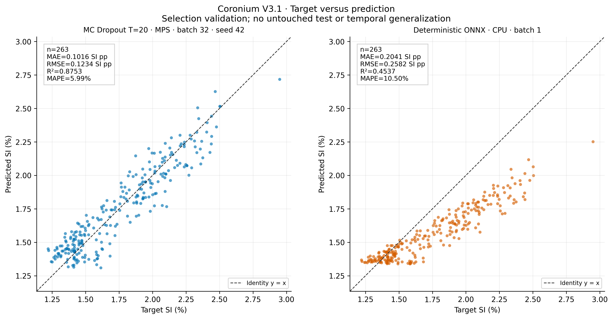

[PDF vectorial](figures/01_target_prediction.pdf) · [SVG](figures/01_target_prediction.svg)

### 02_residuals

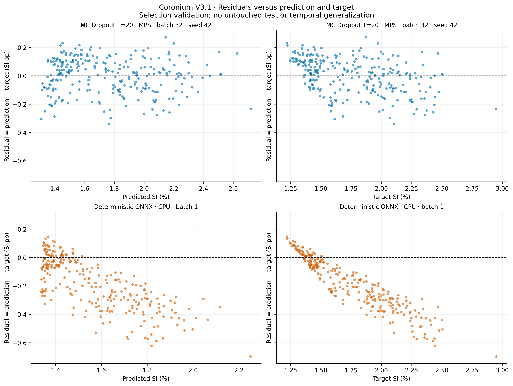

[PDF vectorial](figures/02_residuals.pdf) · [SVG](figures/02_residuals.svg)

### 03_residual_distribution

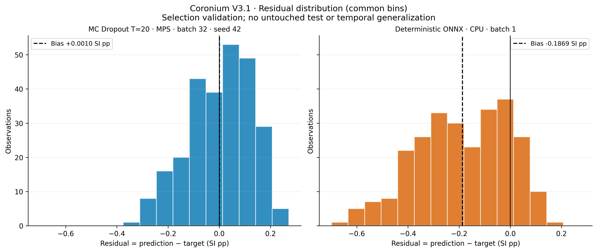

[PDF vectorial](figures/03_residual_distribution.pdf) · [SVG](figures/03_residual_distribution.svg)

### 04_absolute_error_distribution

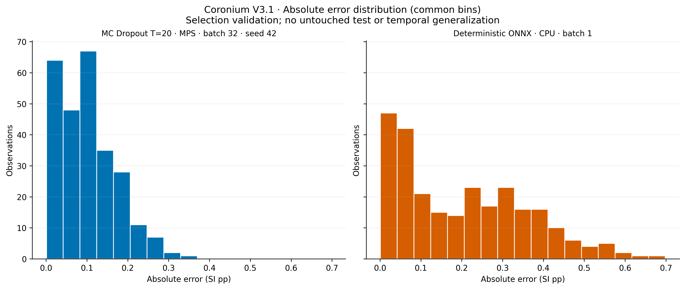

[PDF vectorial](figures/04_absolute_error_distribution.pdf) · [SVG](figures/04_absolute_error_distribution.svg)

### 05_activity_band_errors

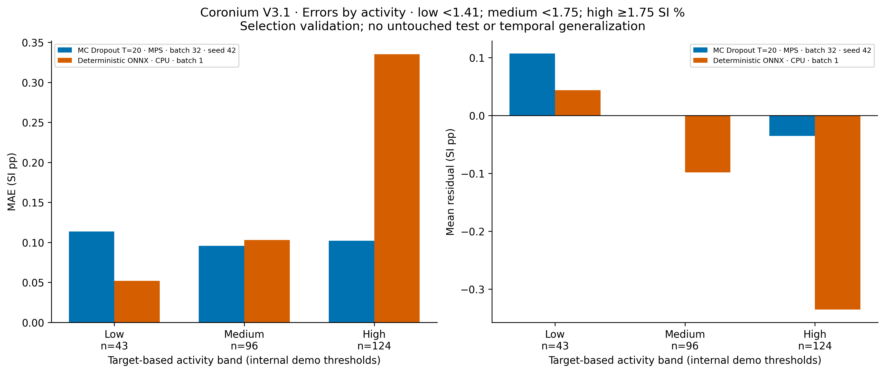

[PDF vectorial](figures/05_activity_band_errors.pdf) · [SVG](figures/05_activity_band_errors.svg)

### 06_training_validation

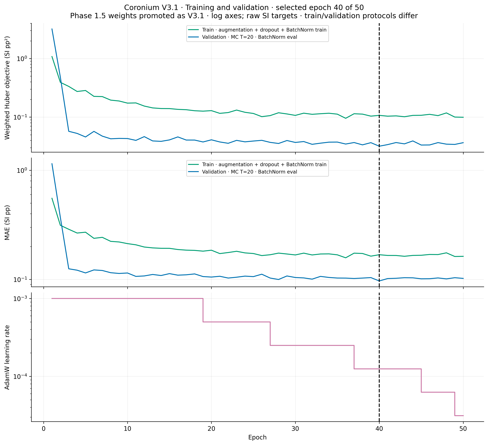

[PDF vectorial](figures/06_training_validation.pdf) · [SVG](figures/06_training_validation.svg)

### 07_protocol_difference

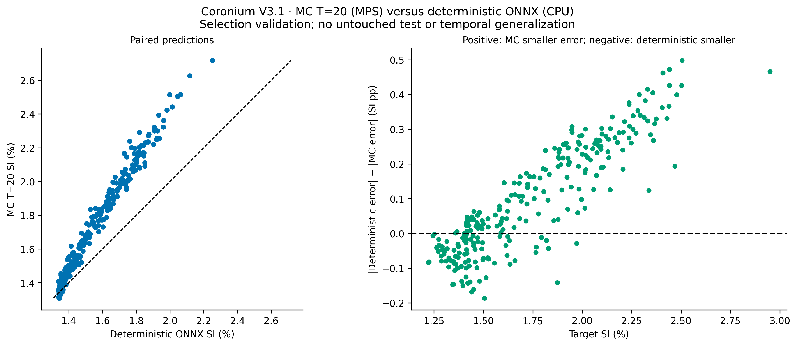

[PDF vectorial](figures/07_protocol_difference.pdf) · [SVG](figures/07_protocol_difference.svg)

### 08_clean_baseline

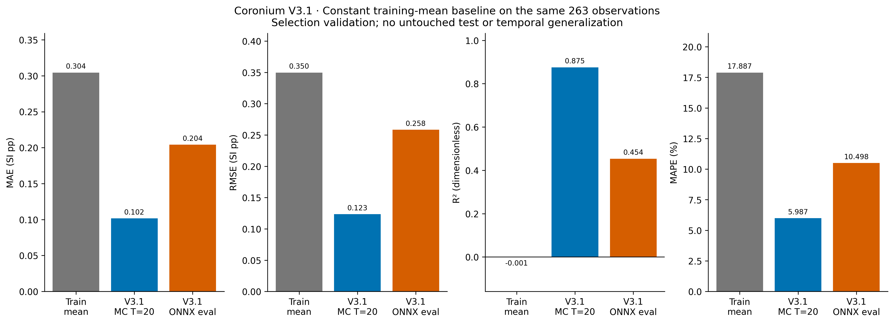

[PDF vectorial](figures/08_clean_baseline.pdf) · [SVG](figures/08_clean_baseline.svg)

### 09_largest_error_cases

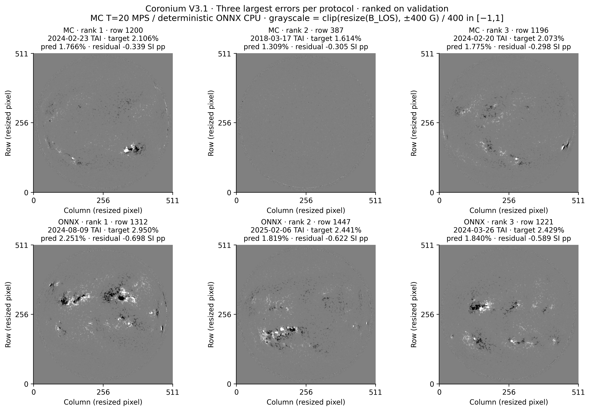

[PDF vectorial](figures/09_largest_error_cases.pdf) · [SVG](figures/09_largest_error_cases.svg)

### 10_error_by_record_year

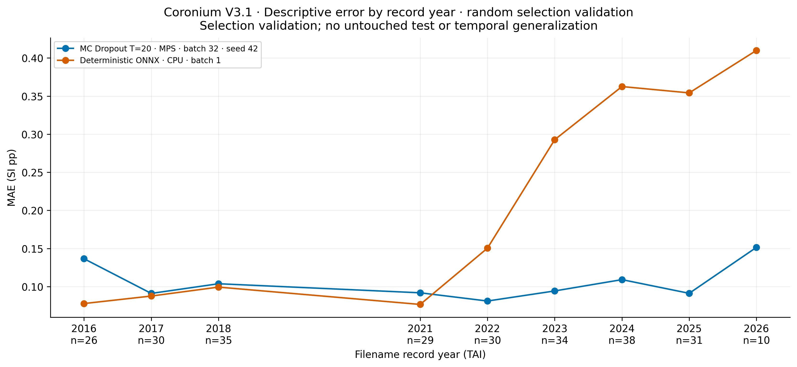

[PDF vectorial](figures/10_error_by_record_year.pdf) · [SVG](figures/10_error_by_record_year.svg)

### 11_latency

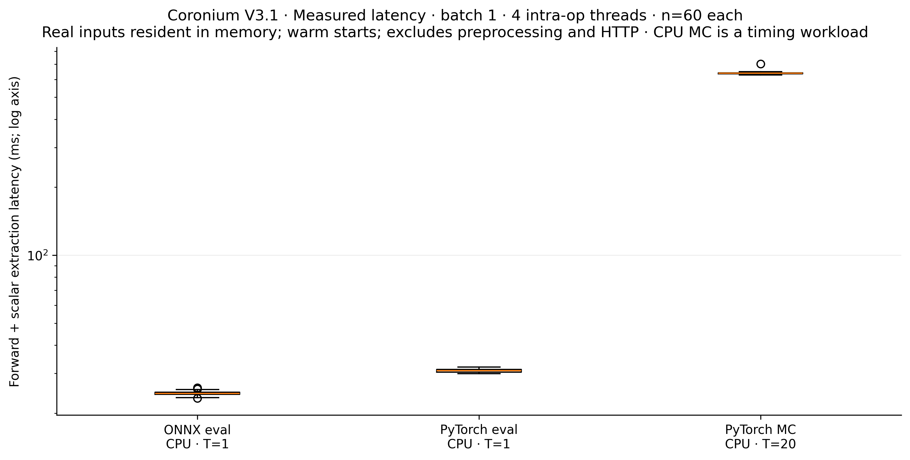

[PDF vectorial](figures/11_latency.pdf) · [SVG](figures/11_latency.svg)

### 12_architecture

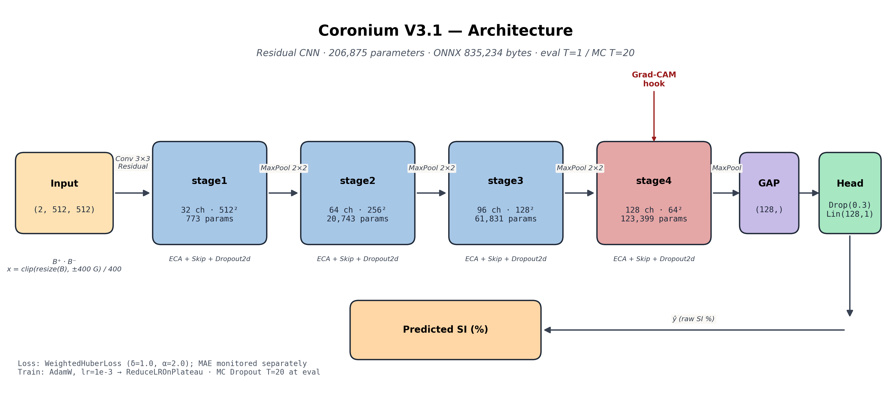

[PDF vectorial](figures/12_architecture.pdf) · [SVG](figures/12_architecture.svg)

### 13_gradcam_largest_deterministic_error

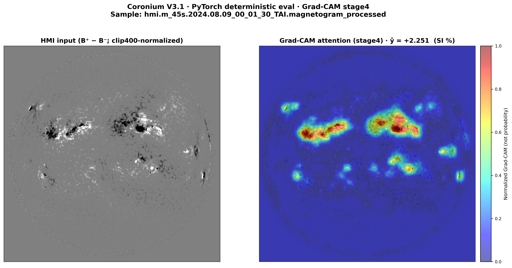

[PDF vectorial](figures/13_gradcam_largest_deterministic_error.pdf) · [SVG](figures/13_gradcam_largest_deterministic_error.svg)
