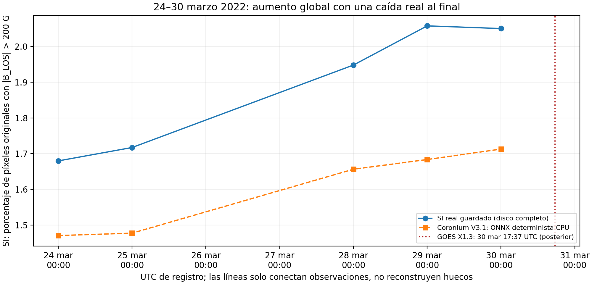
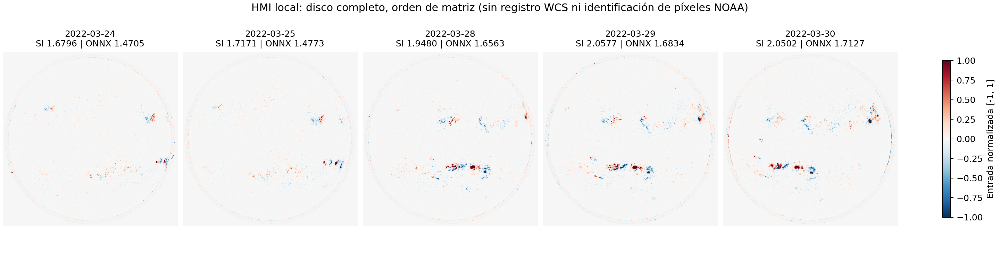

# FASE 2 — Selección del caso histórico para Coronium V3.1

Fecha de ejecución: 6 de septiembre de 2026. Alcance: selección y documentación de observaciones existentes, sin implementar el gemelo digital ni fases posteriores.

## Decisión

Se recomienda **24, 25, 28, 29 y 30 de marzo de 2022**, cinco magnetogramas HMI locales de disco completo, como estados históricos asociados al paso de **NOAA 12975** y al contexto previo a la llamarada **GOES X1.3 del 30 de marzo, máximo 17:37 UTC**.

La secuencia es utilizable como **evolución observada del SI de disco completo con contexto regional documentado**. La identidad NOAA se mantiene en los boletines de los cinco momentos; los archivos no son recortes exclusivos de esa región. No representa un seguimiento espacial registrado, una reconstrucción física 3D, una predicción de llamaradas ni una validación nueva del modelo.

**No se necesita adquirir ningún magnetograma adicional para esta selección de cinco estados.** Se consultaron y conservaron únicamente metadatos de texto externos. No se descargaron magnetogramas, FITS, imágenes solares ni vídeos.

## Inventario y criterio de selección

Se comprobaron las **1.763 filas CSV**, que corresponden a **1.314 observaciones únicas** y **449 filas repetidas** concordantes. Cada `.npy` local está presente, tiene metadatos, SHA-256 y una matriz float32 finita de 512 × 512 dentro de [-1, 1]. También se contrastó su media con el CSV. La cobertura real es 2016-02-03–2026-04-12; faltan 2019 y 2020. `data/raw/` está vacío; las 16 muestras de `data/sample/` son copias de observaciones del catálogo y no amplían la cobertura temporal.

Se enumeraron **953 ventanas de cinco observaciones consecutivas con duración ≤10 días**. Ese inventario temporal es general; la revisión externa detallada se concentró en **35 archivos de cinco episodios históricos**, no en todas las llamaradas de la cobertura ni en un óptimo global demostrado. Se calcularon nuevas predicciones deterministas para los 35 candidatos, sin entrenamiento ni selección por el error de predicción.

La decisión prioriza datos locales, cinco tiempos reales, presencia documental continuada de una región, proximidad a una llamarada relevante y aumento aproximado del SI. Se conserva la caída real del último paso. No se ordenaron archivos por SI ni se eliminaron observaciones intermedias dentro del intervalo elegido: esos cinco archivos son **todos los disponibles entre el 24 y el 30 de marzo**.

| Episodio revisado | Archivos locales y fechas | Región / HARP de catálogo | Evaluación |
| --- | --- | --- | --- |
| Agosto–septiembre 2017 | 7: ago 23, 28, 30, 31; sep 3, 13, 14 | NOAA 12673 / HARP 7115 | X9.3 el 6-sep y X8.2 el 10-sep. Sólo 30-ago, 31-ago y 3-sep tienen 12673 en la tabla I SRS; no hay archivos del 4 al 12-sep. No alcanza cinco momentos documentados de la región alrededor de los eventos. |
| **Marzo–abril 2022** | **8: mar 24, 25, 28, 29, 30; abr 1, 3, 5** | **NOAA 12975 / HARP 8088** | **Mejor equilibrio entre cinco estados previos, aumento global y presencia regional.** Abril 1 y 3 aportan contexto posterior opcional; abril 5 ya no lista 12975 en tabla I. |
| Diciembre 2023 | 6: dic 8, 11, 13, 16, 17, 18 | NOAA 13514 / HARP 10489 | X2.8 el 14-dic. El SI cae primero (1,818812 → 1,688373) y se recupera; hay hueco 13→16-dic. La región alcanza N05W94 el 18-dic, fuera del disco frontal. Menos adecuada para el objetivo de aumento previo. |
| Mayo 2024 | 6: may 4, 5, 8, 10, 11, 15 | NOAA 13664 / HARP 11149 | Alternativa histórica fuerte: cinco primeras imágenes tienen 13664 en SRS, pero SI 2,191842 → 2,062845, descenso neto y fluctuaciones. El valor alto del 15-may no justifica añadirlo como crecimiento de 13664: ya no aparece en tabla I. |
| Septiembre–octubre 2024 | 8: sep 25, 26, 29; oct 3, 6, 7, 9, 10 | NOAA 13842 / HARP 11930 | X7.1 el 1-oct y X9.0 el 3-oct. 13842 no figura en tabla I el 25/26-sep. Sólo dos archivos con esa identificación antes del X9.0: 29-sep y 3-oct; después domina el descenso del SI. |

El detalle **por cada uno de los 35 archivos**, con hora, SI, predicción, ubicación, evidencia SRS y partición, está en [candidates.md](../auralis-back/reports/phase2_historical_case/candidates.md). [candidates.csv](../auralis-back/reports/phase2_historical_case/candidates.csv) añade hashes, filas originales, otros grupos solares, evento de contexto y diferencia temporal respecto a él. Una región no listada en SRS no se interpreta como ausencia física demostrada: sólo limita la atribución documental.

Eventos contrastados: [NOAA septiembre 2017](https://www.ngdc.noaa.gov/stp/space-weather/swpc-products/daily_reports/solar_event_reports/2017/09/20170906events.txt), [NOAA diciembre 2023](https://www.spaceweather.gov/news/sunspot-region-produces-x28-flare-largest-sep-10-2017), [NOAA mayo 2024](https://www.spaceweather.gov/news/region-3664-not-done-yet-produces-x87-flarelargest-solar-cycle), [NOAA octubre 2024](https://www.ngdc.noaa.gov/stp/space-weather/swpc-products/daily_reports/solar_event_reports/2024/10/20241003events.txt). Los boletines de texto de esos eventos están archivados en `sources/`.

## Cinco estados recomendados

Todos tienen registro **00:01:30 TAI = 00:00:53 UTC**. Se conserva por separado `date` del CSV, cuya escala no está documentada. La hora convertida es la del **registro del nombre**, no una nueva determinación de la hora exacta de exposición `T_OBS`.

| Estado | Fecha UTC, 00:00:53 | SI real guardado (%) | V3.1 ONNX (%) | Cambio SI (pp) | NOAA 12975: ubicación SRS | Tipo magnético SRS | Separación |
| --- | --- | ---: | ---: | ---: | --- | --- | --- |
| 1 | 2022-03-24 | 1,679617 | 1,470520 | — | N13E63 | Beta | — |
| 2 | 2022-03-25 | 1,717091 | 1,477280 | +0,037473 | N14E55 | Beta | 24 h |
| 3 | 2022-03-28 | 1,947987 | 1,656259 | +0,230896 | N12E05 | Beta | 72 h |
| 4 | 2022-03-29 | 2,057672 | 1,683445 | +0,109684 | N13W12 | Beta-Gamma | 24 h |
| 5 | 2022-03-30 | 2,050173 | 1,712676 | −0,007498 | N13W25 | Beta-Gamma-Delta | 24 h |

Archivos originales seleccionados, sin copiar ni modificar sus matrices:

1. [hmi.m_45s.2022.03.24_00_01_30_TAI.magnetogram_processed.npy](../auralis-back/data/processed/hmi.m_45s.2022.03.24_00_01_30_TAI.magnetogram_processed.npy)
2. [hmi.m_45s.2022.03.25_00_01_30_TAI.magnetogram_processed.npy](../auralis-back/data/processed/hmi.m_45s.2022.03.25_00_01_30_TAI.magnetogram_processed.npy)
3. [hmi.m_45s.2022.03.28_00_01_30_TAI.magnetogram_processed.npy](../auralis-back/data/processed/hmi.m_45s.2022.03.28_00_01_30_TAI.magnetogram_processed.npy)
4. [hmi.m_45s.2022.03.29_00_01_30_TAI.magnetogram_processed.npy](../auralis-back/data/processed/hmi.m_45s.2022.03.29_00_01_30_TAI.magnetogram_processed.npy)
5. [hmi.m_45s.2022.03.30_00_01_30_TAI.magnetogram_processed.npy](../auralis-back/data/processed/hmi.m_45s.2022.03.30_00_01_30_TAI.magnetogram_processed.npy)

La [tabla de selección completa](../auralis-back/reports/phase2_historical_case/recommended_sequence.csv) conserva el SHA-256 de cada archivo, los tiempos TAI/UTC, filas CSV (índices desde cero), partición, ubicación y fuente. Filas originales: 807/808, 809, 810, 811/812 y 813/814, respectivamente; las repeticiones no son estados nuevos.

## Evolución y significado físico

El SI real aumenta **0,370556 puntos porcentuales**, **22,0619% respecto al primer valor**. Aumenta durante tres pasos y cae **0,007498 pp** en el último. Por tanto, es una evolución de menor a mayor actividad global en el balance de seis días, **no una progresión estrictamente monótona**. El primer estado no es un Sol quieto ni un SI cercano a cero.

La predicción determinista aumenta 1,470520 → 1,712676, **+0,242157 pp**, pero subestima los cinco SI guardados; sus errores firmados van de −0,209098 a −0,374226 pp. Además, no reproduce la pequeña caída final. Deben mostrarse por separado SI real y estimación; no se deben sustituir los valores reales para lograr una curva más suave.



El SI se define como `100 × count(abs(B_LOS) > 200 G) / original_pixel_count`, sobre la matriz original 4096 × 4096, incluidos los píxeles exteriores tratados por el pipeline. No es el porcentaje de área de una región NOAA, flujo magnético total, energía libre, número internacional de manchas ni intensidad de rayos X GOES. Rotación, proyección LOS, entrada/salida de regiones y evolución de otras regiones pueden cambiar el SI sin implicar acumulación de energía en 12975.

Las bandas internas Auralis C/M/X no son clases GOES. En esta selección sólo se usan valores numéricos de SI; las clases M4.0, X1.3, etc., se reservan para eventos reales del catálogo GOES.

## Evidencia regional y ubicación

Los [SRS de NOAA/NCEI del 24](https://www.ngdc.noaa.gov/stp/space-weather/swpc-products/daily_reports/solar_region_summaries/2022/03/20220324SRS.txt), [25](https://www.ngdc.noaa.gov/stp/space-weather/swpc-products/daily_reports/solar_region_summaries/2022/03/20220325SRS.txt), [28](https://www.ngdc.noaa.gov/stp/space-weather/swpc-products/daily_reports/solar_region_summaries/2022/03/20220328SRS.txt), [29](https://www.ngdc.noaa.gov/stp/space-weather/swpc-products/daily_reports/solar_region_summaries/2022/03/20220329SRS.txt) y [30 de marzo](https://www.ngdc.noaa.gov/stp/space-weather/swpc-products/daily_reports/solar_region_summaries/2022/03/20220330SRS.txt) identifican la misma **2975**, abreviación operacional de **12975**. Las posiciones son heliográficas aproximadas, válidas a las 00:00 UTC, 53 segundos antes del registro convertido; el boletín se emite a las 00:30 UTC. Son contexto histórico retrospectivo, no metadatos disponibles necesariamente al instante de la imagen.

El desplazamiento N13E63 → N14E55 → N12E05 → N13W12 → N13W25 y la identificación repetida sustentan continuidad de la misma región en el disco observado. E/W indican longitudes este/oeste respecto al meridiano central; N indica latitud norte. No se infirieron posiciones de píxeles desde la apariencia de la imagen. En el primer estado, E63 introduce proyección importante.

La [tabla oficial JSOC HARP–NOAA](http://jsoc.stanford.edu/doc/data/hmi/harpnum_to_noaa/all_harps_with_noaa_ars.txt), conservada en [el snapshot local](../auralis-back/reports/phase2_historical_case/sources/harp_mapping_attempt_0.txt), contiene `8088 12975,12976,12977,12984`. Esto **no es una correspondencia uno a uno**: es la asociación del parche durante su vida; no demuestra que todas esas regiones estuviesen simultáneamente presentes en cada estado. El HARP definitivo 8088 no se debe confundir con identificadores NRT de otras fuentes.

La complejidad SRS evoluciona de Beta a Beta-Gamma y Beta-Gamma-Delta. Sin embargo, el área de manchas de 12975 en los boletines es **160, 160, 50, 210 y 300 millonésimas de hemisferio**: tampoco es monótona. Esto impide presentar el aumento de SI de disco como crecimiento continuo medido de esa región.

Los propios boletines prueban la presencia de otras regiones: 12974 en el primer estado; 12974 y 12976 en el segundo; y hasta seis regiones adicionales en los últimos. El [análisis observacional de STCE](https://www.stce.be/newsletter/pdf/2022/STCEnews20220408.pdf), pp. 2–3 y 9, vincula la actividad de fin de marzo y la llamarada X1.3 con 2975 y describe la complejidad del entorno regional.

**Conclusión de identidad:** hay evidencia externa sólida de la misma región NOAA presente en los cinco momentos. No hay evidencia suficiente para afirmar que las cinco matrices pertenecen exclusivamente a esa región, que sus píxeles están registrados en una misma superficie solar, ni que todo su SI corresponde a 12975. Los `.npy` no conservan cabeceras WCS ni máscaras HARP.



La lámina conserva valores y un mismo rango de color. Se muestra el orden de matriz con `origin=lower`, sin rotación ni registro astrométrico. No se certifica norte/este arriba/izquierda ni se asignan manchas visibles a NOAA mediante esa lámina.

## Llamaradas asociadas y relación con los estados

Datos del archivo oficial de eventos editados NOAA: [28-mar](https://www.ngdc.noaa.gov/stp/space-weather/swpc-products/daily_reports/solar_event_reports/2022/03/20220328events.txt), [29-mar](https://www.ngdc.noaa.gov/stp/space-weather/swpc-products/daily_reports/solar_event_reports/2022/03/20220329events.txt), [30-mar](https://www.ngdc.noaa.gov/stp/space-weather/swpc-products/daily_reports/solar_event_reports/2022/03/20220330events.txt) y [31-mar](https://www.ngdc.noaa.gov/stp/space-weather/swpc-products/daily_reports/solar_event_reports/2022/03/20220331events.txt). Horas UTC, clases GOES reales, región 12975:

| Fecha | Inicio | Máximo | Fin | GOES | Relación temporal |
| --- | --- | --- | --- | --- | --- |
| 2022-03-28 | 10:58 | 11:29 | 11:45 | M4.0 | Posterior al estado 3; anterior al estado 4. |
| 2022-03-28 | 20:49 | 20:59 | 21:09 | M1.1 | Entre estados 3 y 4. |
| 2022-03-29 | 00:57 | 01:11 | 01:26 | M2.2 | Unos 70 minutos después del estado 4. |
| 2022-03-29 | 21:43 | 21:52 | 21:57 | M1.6 | Entre estados 4 y 5. |
| **2022-03-30** | **17:21** | **17:37** | **17:46** | **X1.3** | **Máximo 17 h 36 min 07 s después del estado 5.** |
| 2022-03-31 | 18:17 | 18:35 | 18:45 | M9.6 | Posterior a los cinco estados; no hay magnetograma local de ese día. |

Los estados 1 y 2 son contexto previo a esos eventos de 12975, no instantes de llamarada. Los estados 3, 4 y 5 preceden las llamaradas principales de sus respectivos días. Ninguno captura el máximo X1.3 ni muestra la respuesta inmediatamente posterior.

Se preservan diferencias de catálogo sin fusionarlas arbitrariamente: STCE enumera también eventos M1.0 del 28-mar que no aparecen como tales en el snapshot NOAA descargado; NASA SVS menciona 13:35 EDT para X1.3, mientras el registro NOAA y STCE coinciden en **17:37 UTC**, hora adoptada aquí. La tabla anterior es una selección trazable de eventos, no una lista exhaustiva de todas las llamaradas ni una reconciliación de todas las revisiones GOES.

Tampoco se asignan por fecha todas las llamaradas a 12975: el **M1.4 del 25-mar 05:26 UTC** figura en NOAA para **12974**; el M1.1 del 29-mar 01:58 UTC también corresponde a 12974, y el M1.0 de 09:38 del 29-mar tiene región ausente en ese boletín. Las filas originales, identificadores y fuentes se conservan en [cataloged_mx_events.csv](../auralis-back/reports/phase2_historical_case/cataloged_mx_events.csv). Ese CSV conserva filas de los días consultados, incluidos posibles duplicados de catálogo; no debe interpretarse como un recuento exhaustivo de eventos únicos.

## Trazabilidad, modelo y limitaciones

- **Tiempo:** nombres HMI `hmi.m_45s` identifican registros TAI. Astropy convierte TAI→UTC sin acceder a la red. `date` CSV permanece separado y no se relabela como UTC. Para recuperar `T_OBS`, `QUALITY`, orientación y geometría precisas harían falta cabeceras del registro original; aquí no están conservadas.
- **SI real:** es la etiqueta medida originalmente y guardada, no una medición nueva. Los FITS originales no están locales. El resize y clip pierden información, por lo que no se puede reconstruir exactamente el SI original a partir del `.npy`; ni el chequeo de la media ni los hashes prueban por sí solos la calibración instrumental original.
- **Predicción:** ONNX activo `best_coronium_v3_1.onnx`, CPU, batch 1, cuatro hilos intra-op; entrada compartida B+/B−, sin ruido, MC Dropout ni transformaciones de target. Se validó el manifiesto de la versión activa. Valores equivalentes al protocolo de la API; no se ejecutó HTTP durante esta fase. Para presentación API: 1,4705; 1,4773; 1,6563; 1,6834; 1,7127.
- **Validación:** cuatro estados fueron usados en entrenamiento; el 28-mar pertenece a validación de selección. Esta secuencia no es un test independiente ni evidencia de generalización temporal. No se modificaron pesos, métricas oficiales, API ni frontend. Las métricas oficiales MC de V3.1 siguen siendo otro protocolo, separado de estas predicciones deterministas.
- **Cadencia:** 24, 72, 24 y 24 horas. No hay datos locales de 26/27-mar ni una muestra cercana al inicio o pico X1.3. Los segmentos de la gráfica sólo conectan muestras; no son mediciones ni interpolación física validada.
- **Interpretación regional:** el input y el target son de disco completo, múltiples regiones están presentes y HARP 8088 agrupa varias identidades NOAA. No se ha calculado SI regional, flujo desproyectado, alineamiento por rotación diferencial ni seguimiento de píxeles. No se debe aplicar el modelo a un recorte y asumir la misma validez del contrato de disco completo.
- **Alcance de auditoría:** se verificó integridad y coherencia numérica de todos los `.npy`; faltan cabeceras y banderas de calidad HMI para una auditoría instrumental completa. La lámina fue inspeccionada visualmente para verificar render y diferencias entre estados, no para certificar coordenadas.

## Necesidad de datos adicionales

**Para los cinco estados seleccionados: no.** La secuencia local basta si el futuro uso mantiene el alcance de disco completo y el contexto regional descrito.

Si se prefiriese incluir un estado posterior al X1.3, existe ya el archivo del **1 de abril, 00:00:53 UTC**: SI 1,980442; ONNX 1,698625 (valor completo en CSV); 12975 en N13W52. Está a unas 30 h 24 min del máximo. Puede sustituir al 25-mar o añadirse como sexto estado en una decisión posterior, aceptando la caída del SI y el gran intervalo sin observación; no requiere adquisición.

Sólo si se exigiese observar el cambio inmediato alrededor de la llamarada o certificar seguimiento físico exclusivo de 12975 serían insuficientes estos datos procesados. El primer paso sería consultar **metadatos/cabeceras y máscaras** de los registros existentes. Obtener un magnetograma adicional tendría sentido únicamente para una carencia temporal concreta, cerca de 30-mar 17:21–17:46 UTC, o para recuperar información original indispensable que el `.npy` perdió; no se propone una descarga masiva ni se inició ninguna adquisición. Un archivo adicional por sí solo tampoco resolvería el registro espacial, la proyección o la atribución regional de toda la secuencia.

## Reproducción y entregables

Desde la raíz del repositorio, usando el entorno completo que ya estaba instalado:

```bash
/Users/alejandro/.pyenv/versions/3.12.7/bin/python3 auralis-back/scripts/select_phase2_history.py
```

El script es **offline** y usa los snapshots presentes en `reports/phase2_historical_case/sources/`. Registra versiones, hashes de entradas/salidas y verificaciones en [manifest.json](../auralis-back/reports/phase2_historical_case/manifest.json) y [verification.json](../auralis-back/reports/phase2_historical_case/verification.json). Las URLs, fechas de consulta, hashes y errores de acceso de fuentes externas están en [retrieval_manifest.json](../auralis-back/reports/phase2_historical_case/sources/retrieval_manifest.json); la tabla HARP se obtuvo por HTTP del host oficial tras fallar HTTPS, limitación de transporte que se deja registrada.

Entregables principales:

- [Inventario de las 1.314 observaciones](../auralis-back/reports/phase2_historical_case/local_inventory.csv) y [953 ventanas consecutivas](../auralis-back/reports/phase2_historical_case/five_state_windows_up_to_10_days.csv).
- [35 candidatos documentados](../auralis-back/reports/phase2_historical_case/candidates.md) y [CSV completo](../auralis-back/reports/phase2_historical_case/candidates.csv).
- [Secuencia recomendada de cinco estados](../auralis-back/reports/phase2_historical_case/recommended_sequence.csv).
- [Eventos M/X catalogados de los días consultados](../auralis-back/reports/phase2_historical_case/cataloged_mx_events.csv), con fuente y línea.
- [Lámina de magnetogramas](../auralis-back/reports/phase2_historical_case/selected_magnetograms.png), [gráfica PNG](../auralis-back/reports/phase2_historical_case/activity_evolution.png) y [SVG](../auralis-back/reports/phase2_historical_case/activity_evolution.svg).

Verificación: 1.314 matrices válidas y vinculadas al inventario; metadatos repetidos concordantes; cinco tiempos ordenados y región presente en los cinco SRS; eventos de referencia confirmados en NOAA; repetición exacta de las cinco predicciones. En los **13 candidatos** con resultado ONNX congelado de Fase 1.6, diferencia máxima **2,22 × 10⁻¹⁶**, debida a lectura/escritura decimal. No se realizaron nuevas pruebas de generalización ni entrenamiento.

La selección histórica queda terminada con sus límites explícitos. No se comenzó Unity, timeline, WebAR ni el desarrollo del gemelo.

**FASE 2: CUMPLIDA**
